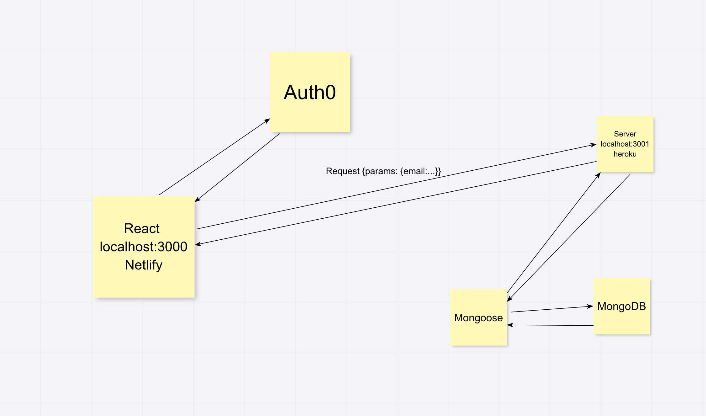

# Best Books Back End

**Author**: Jessi Velazquez Jakob Lumpkin
**Version**: 1.1.0 (increment the patch/fix version number if you make more commits past your first submission)

## Overview
<!-- Provide a high level overview of what this application is and why you are building it, beyond the fact that it's an assignment for this class. (i.e. What's your problem domain?) -->
This is the back end server for Best Books.

## Getting Started
<!-- What are the steps that a user must take in order to build this app on their own machine and get it running? -->
1. Clone repository from GitHub

## Architecture
<!-- Provide a detailed description of the application design. What technologies (languages, libraries, etc) you're using, and any other relevant design information. -->

## Change Log
<!-- Use this area to document the iterative changes made to your application as each feature is successfully implemented. Use time stamps. Here's an example:

01-01-2001 4:59pm - Application now has a fully-functional express server, with a GET route for the location resource. -->

## Credit and Collaborations
<!-- Give credit (and a link) to other people or resources that helped you build this application. -->
[https://reactrouter.com/web/api/BrowserRouter](https://reactrouter.com/web/api/BrowserRouter)

**Feature Timing**

Name of feature: Set Up Back End

Estimate of time needed to complete: 5 hours

Start time: 1:45pm

Finish time: 

Actual time needed to complete: 
